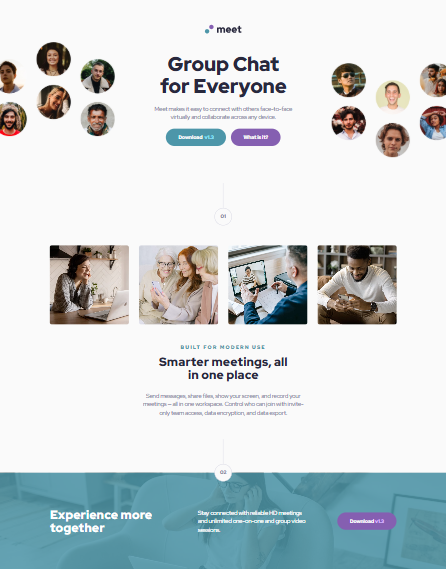

# Frontend Mentor - Meet Landing Page

This is my solution to the [Meet landing page challenge on Frontend Mentor](https://www.frontendmentor.io). The challenge is to build a responsive landing page that closely matches the provided design.

## 🚀 Live Site

- **Live URL**: [Add your live site link here](https://mohammed-osama-pg.github.io/FdMr-Meet-landing-page/)
- **GitHub Repo**: [Add your GitHub repo link here](https://github.com/Mohammed-Osama-pg/FdMr-Meet-landing-page.git)

## 📑 Table of Contents

- [Pre-Project Notes](#-pre-project-notes)
  - [What's the challenge?](#-whats-the-challenge)
  - [Requirements](#-requirements)
  - [Ideas to test myself](#-ideas-to-test-myself)
  - [Resources](#-resources)
  - [Time Taken](#-time-taken)
- [Built With](#️-built-with)
- [Screenshot](#-screenshot)
- [What I Learned](#-what-i-learned)
- [Useful Resources](#-useful-resources)
- [Author](#-author)

---

## 📝 Pre-Project Notes

### ❓ What's the challenge?

The challenge is to build out this landing page and get it looking as close to the design as possible.

### 📋 Requirements

**Users should be able to:**

- View the optimal layout depending on their device's screen size
- See hover states for interactive elements

### 💡 Ideas to test myself

- Write the styles using a CSS pre-processor like Sass, Less, or Stylus
- Train my eye for detail by matching the solution to the design
- Try estimating the time it will take to build the project and compare with actual time
- Use testing tools to validate and improve the quality of the code

### 🔍 Resources

- [LambdaTest](https://www.lambdatest.com/) – For testing across browsers
- [Nu HTML Checker](https://validator.w3.org/nu/#textarea) – HTML validation
- [W3 CSS Validator](https://jigsaw.w3.org/css-validator/) – CSS validation

### ⏱️ Time Taken

**Estimated Time:**

- 60m for search and reviewing the design
- 240m for coding
- 60m for testing, adjustments, and writing the README

**Actual Time:**

- 53m – Search and review
- 13m – Initial setup
- 59m – Development
- 42m – Layout adjustments
- 74m – Styling and responsiveness
- 75m – Finishing layout and hover states
- 83m – Final polishing
- 20m – Testing
- 15m – Error checking

---

## 🛠️ Built With

- HTML5
- Sass (SCSS)
- Mobile-first workflow
- CSS Flexbox & Grid

## 📸 Screenshot

  

## 💡 What I Learned

In this project, I practiced responsive layouts, hover effects, and used validation tools to refine my code. I also improved my accuracy in estimating project time and followed a structured testing workflow.

## 📚 Useful Resources

- [LambdaTest](https://www.lambdatest.com/)
- [Nu HTML Checker](https://validator.w3.org/nu/#textarea)
- [W3 CSS Validator](https://jigsaw.w3.org/css-validator/)

## 👤 Author

- GitHub – [Mohammed-Osama](https://github.com/Mohammed-Osama-pg)
- Frontend Mentor – [@Mohammed-Osama](https://www.frontendmentor.io/profile/Mohammed-Osama-pg)
- LinkedIn – [@Mohammed-Osama](https://www.linkedin.com/in/mohammed-osama-a4124228b)
